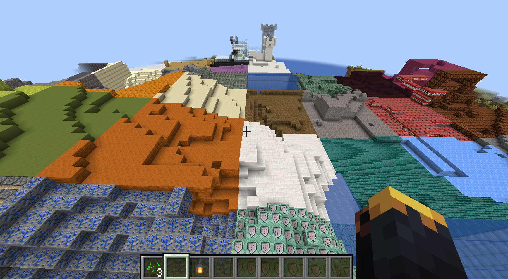

# DYNAMIC CHUNK GENERATION

Experimental procedural world-generation framework for Minecraft focused on dynamic chunk mutation, randomized terrain composition, and unpredictable environmental generation systems.

---

## Overview

Dynamic Chunk Generation introduces a procedural gameplay system that transforms newly generated chunks into fully randomized terrain compositions using dynamically selected block generation logic.

The project focuses on experimental world-generation mechanics, environmental unpredictability, and procedural gameplay variation across all Minecraft dimensions.

---

## Core Features

- Dynamic chunk mutation systems
- Procedural randomized terrain generation
- Cross-dimension world generation support
- Experimental environmental composition
- Real-time chunk transformation mechanics
- Custom generation behavior systems
- Multiplayer-compatible world interactions

---

## Generation Systems

The project is designed around procedural world mutation and unpredictable environmental generation behavior.

Included systems:
- Real-time chunk randomization
- Dynamic block composition generation
- Procedural terrain mutation
- Dimension-wide generation support
- Environmental variation systems
- Experimental world-generation logic

---

## Technical Overview

- Custom chunk processing systems
- Procedural generation architecture
- Dynamic terrain mutation logic
- Event-driven world generation
- Optimized chunk transformation handling
- Cross-dimension synchronization support

---

## Preview

  

---

## Status

Active experimental procedural generation project under continued development.
